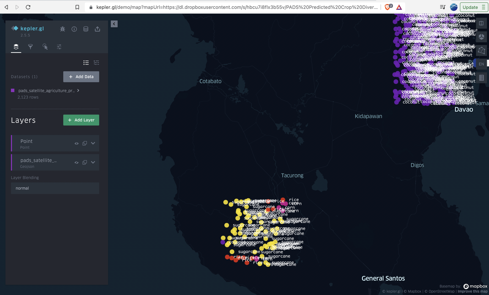

# Precision Agriculture and Data Science (PADS)
This repository contains codes and documentation on performing precision agriculture and data science in the Philippines using satellite or remote sensing data.  

Author: Xavier Puspus  
Web Application: Linked [here](https://kepler.gl/demo/map?mapUrl=https://dl.dropboxusercontent.com/s/hbcu7i8flx3b55v/PADS%20Predicted%20Crop%20Diversity%20Map.json)  
Project Whitepaper: Linked [here](https://docs.google.com/document/d/1QMVp6mhK50pHDta3bYZQSLuq89pzKKBlEIU00-9w2vQ/edit?usp=sharing)
Video Presentation: Linked [here](https://youtu.be/dviG9aV0XmI)

### Summary
Agriculture is one of the most important aspects of the Philippine economy. This project focuses on using modeling techniques on data collected from NASA’s to identify potential areas for crop diversification (growing rice and sugarcane in some areas, coconut, corn, banana in others) anywhere in the Philippines, and in the highest resolution possible (longitude, latitude pairs). 

### Web Application

